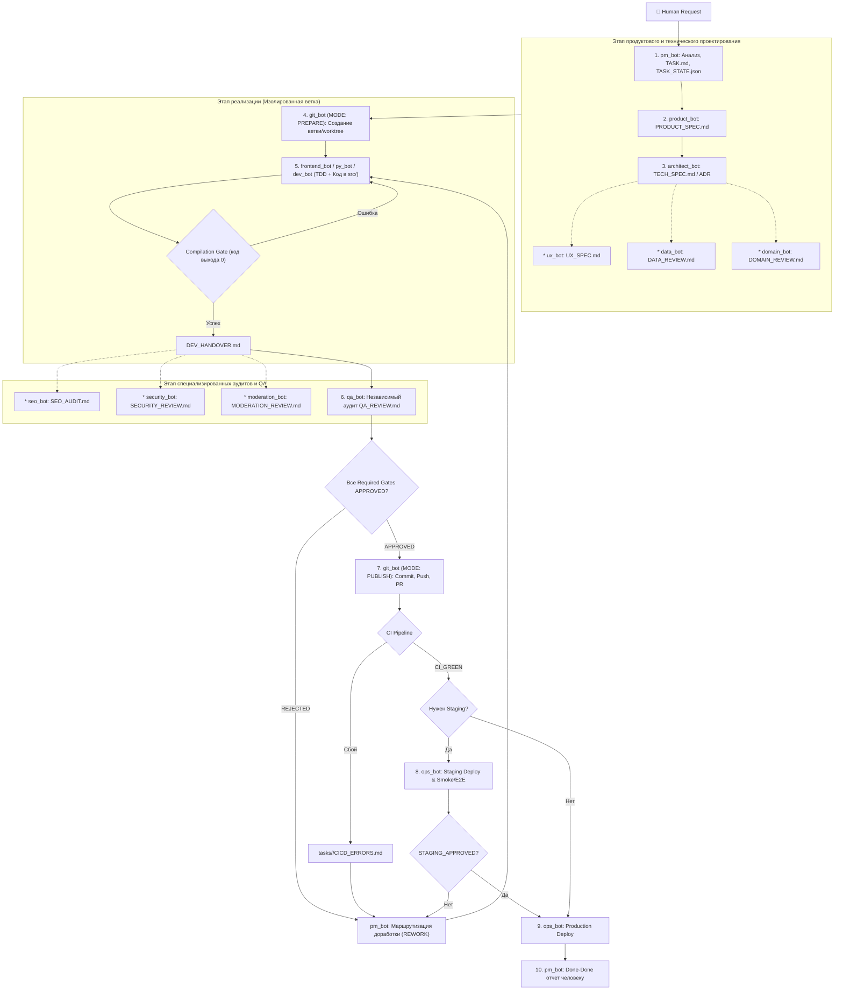

### Регламент мультиагентной разработки Antigravity 2.0: Операционное руководство

Настоящий документ определяет целевую архитектуру, конечный автомат состояний, правила маршрутизации и протокол взаимодействия 15 специализированных агентов команды в модели **«Фабрика Продукта» (Product Factory)**.

---

## 1. Контекст платформы и этапы развития

Мы создаем **самостоятельную отраслевую цифровую платформу коммерческих смарт-контрактов** вокруг проектируемой Платформы коммерческих смарт-контрактов Банка России — ПКСК.
> **Важнейшее разграничение**: Платформа **НЕ ЯВЛЯЕТСЯ** ПКСК, платформой цифрового рубля, сервисом Банка России или оператором ПКСК.

Платформа развивается по 5 сквозным этапам, накапливающим единую доменную модель:
- **Этап 1**: Профессиональная социальная сеть, база знаний, рейтинги, подтверждение компетенций, SEO/GEO.
- **Этап 2**: Визуальный конструктор смарт-контрактов (бизнес-логика, события, условия, оракулы).
- **Этап 3**: Рынок поставщиков внешних данных (датасеты, SLA, интеграции).
- **Этап 4**: Маркетплейс готовых коммерческих смарт-контрактов.
- **Этап 5**: Биржа заказов, аудита и профессиональных услуг (заказчики, разработчики, юристы, ИБ).

Все доменные сущности (`User`, `Organization`, `Role`, `Competency`, `Publication`, `Question`, `Answer`, `Case`, `Reputation`, `SmartContractScenario`, `SmartContract`, `DataProvider`, `Dataset`, `Order`, `Project`, `Review`) формируют взаимосвязанный граф знаний и доверия.

---

## 2. Принцип минимальной необходимой сложности и Required Gates

Система не запускает всех 15 агентов на каждую задачу. 
`pm_bot` проводит классификацию и активирует **минимально достаточный набор Required Gates** на основе оценки рисков:

### Обязательное ядро для продуктовых задач:
`pm_bot` $\rightarrow$ `product_bot` $\rightarrow$ `architect_bot` $\rightarrow$ `git_bot (PREPARE)` $\rightarrow$ Разработчик (`frontend_bot` / `py_bot` / `dev_bot`) $\rightarrow$ `qa_bot` $\rightarrow$ `git_bot (PUBLISH)`.

### Условные специализированные гейты (подключаются по необходимости):
- **`ux_bot`**: при изменении интерфейса или пользовательских сценариев $\rightarrow$ артефакт `UX_SPEC.md`.
- **`frontend_bot`**: при необходимости веб-разработки (TypeScript / React / Next.js) $\rightarrow$ `DEV_HANDOVER.md`.
- **`data_bot`**: при изменениях схемы БД, миграциях, полнотекстовом поиске, рейтингах $\rightarrow$ `DATA_REVIEW.md`.
- **`domain_bot`**: при затрагивании тематики ПКСК, смарт-контрактов, регуляторики, официальных терминов $\rightarrow$ `DOMAIN_REVIEW.md`.
- **`seo_bot`**: для публичных индексируемых страниц, базы знаний, каталогов, цитируемости в AI $\rightarrow$ `SEO_AUDIT.md`.
- **`security_bot`**: при изменениях авторизации, RBAC, API, загрузке файлов, PII, приватных данных $\rightarrow$ `SECURITY_REVIEW.md` *(Blocking Gate)*.
- **`moderation_bot`**: при внедрении пользовательского контента, голосований, антифрода, подтверждения компетенций $\rightarrow$ `MODERATION_REVIEW.md`.
- **`ops_bot`**: при операциях развертывания, валидации миграций, деплое на Staging/Production $\rightarrow$ `RELEASE_REPORT.md`.

---

## 3. Матрица маршрутизации задач (Routing Matrix)

| Тип задачи | Обязательные агенты (Core) | Условные агенты (Conditional) | Блокирующие гейты (Blocking Gates) |
|---|---|---|---|
| **Frontend UI фича** | pm, product, architect, ux, frontend, qa, git | seo, moderation | Product, Arch, UX, QA |
| **Backend API сервис** | pm, product, architect, py_bot/dev_bot, qa, git | data, security, domain | Product, Arch, QA, (Security/Data при наличии) |
| **Fullstack продуктовая фича** | pm, product, architect, ux, frontend, py/dev, qa, git | data, domain, seo, security, moderation, ops | Product, Arch, UX, Dev, QA, Security, Staging |
| **Изменение БД / Миграция** | pm, architect, data, py/dev, qa, git | security, ops | Arch, Data, QA, Staging |
| **Поиск и индексация** | pm, product, architect, data, frontend, py/dev, qa, git | seo | Product, Arch, Data, QA |
| **Публичный контент / База знаний** | pm, product, architect, ux, frontend, seo, qa, git | moderation, domain | Product, UX, SEO, QA |
| **Авторизация / RBAC / Права** | pm, product, architect, security, py/dev, frontend, qa, git | data | Product, Arch, Security, QA |
| **Пользовательский контент / Репутация** | pm, product, architect, moderation, data, py/dev, frontend, qa, git | security, seo | Product, Arch, Moderation, Data, QA |
| **Сценарии смарт-контрактов / ПКСК** | pm, product, architect, domain, py/dev, frontend, qa, git | security, data | Product, Arch, Domain, QA, Security |
| **Инфраструктура / Релиз** | pm, architect, ops, git | security | Arch, Ops, Staging |
| **Security Hotfix** | pm, security, py/dev/frontend, qa, git | ops | Security, QA, Staging |
| **Обычный Bugfix** | pm, py/dev/frontend, qa, git | architect, security | QA |
| **Косметическая UI-правка** | pm, frontend, qa, git | - | QA |
| **Документация** | pm, product_bot (или технический писатель), git | domain, seo | Product |

---

## 4. Сквозной пайплайн разработки (End-to-End Pipeline)



---

## 5. Конечный автомат состояний (State Machine)

Жизненный цикл задачи формализован в детерминированные состояния:

```
CREATED 
  ↓
PRODUCT_REVIEW → PRODUCT_READY (или PRODUCT_REWORK)
  ↓
ARCH_REVIEW → ARCH_READY (или ARCH_REWORK)
  ↓
[UX_REVIEW → UX_READY] (условно)
[DATA_REVIEW → DATA_READY] (условно)
[DOMAIN_REVIEW → DOMAIN_READY] (условно)
  ↓
BRANCH_PREPARATION → BRANCH_READY
  ↓
IMPLEMENTATION → DEV_READY (или DEV_REWORK)
  ↓
[SEO_REVIEW → SEO_READY] (условно)
[SECURITY_REVIEW → SECURITY_READY] (условно, или SECURITY_REWORK)
[MODERATION_REVIEW → MODERATION_READY] (условно)
  ↓
QA_REVIEW → QA_APPROVED (или QA_REWORK)
  ↓
PR_PREPARATION → PR_OPEN
  ↓
CI_RUNNING → CI_GREEN (или CI_FAILED)
  ↓
[STAGING_DEPLOY → STAGING_DEPLOYED → STAGING_VALIDATION → STAGING_APPROVED] (условно)
  ↓
[PRODUCTION_DEPLOY → PRODUCTION_DEPLOYED] (условно)
  ↓
DONE
```

Дополнительные служебные состояния: `HUMAN_ESCALATION`, `BLOCKED`.

---

## 6. Управление состоянием: `WORKLOG.md` и `TASK_STATE.json`

### 1. `WORKLOG.md` — Append-Only Event Log
- Располагается в корне репозитория.
- **Единый автор**: Писать в `WORKLOG.md` имеет право **ТОЛЬКО `pm_bot`**.
- Формат записи: `[ISO-8601 TIMESTAMP] | TASK-ID | AGENT | EVENT | DESCRIPTION`
- Пример: `2026-08-30T22:15:00+03:00 | TASK-042 | product_bot | PRODUCT_READY | Спецификация согласована`

### 2. `tasks/<issue-folder>/TASK_STATE.json` — Machine-Readable State
- Располагается в папке задачи. Управляется исключительно `pm_bot`.
- Схема:
```json
{
  "task": "TASK-042",
  "state": "QA_REVIEW",
  "rework_count": 0,
  "required_gates": {
    "product": true,
    "architecture": true,
    "ux": true,
    "data": true,
    "domain": false,
    "seo": false,
    "security": true,
    "moderation": false,
    "qa": true,
    "staging": true
  }
}
```

---

## 7. Комплект артефактов и правила изоляции файлов

### Правило чистоты репозитория:
1. **Корень проекта**: содержит ТОЛЬКО глобальный `WORKLOG.md`.
2. **Production-код**: создается в штатной структуре (`apps/`, `src/`, `packages/`, `tests/`, `migrations/`, `infra/`).
3. **Все артефакты задачи**: хранятся СТРОГО в `tasks/<issue-folder>/`.

### Состав папки задачи `tasks/<issue-folder>/`:
- `TASK.md` — ТЗ задачи (создает `pm_bot`)
- `TASK_STATE.json` — машиночитаемое состояние (создает `pm_bot`)
- `PRODUCT_SPEC.md` — продуктовая спецификация (создает `product_bot`)
- `TECH_SPEC.md` / `ADR-XXX.md` — техническая спецификация (создает `architect_bot`)
- `UX_SPEC.md` — интерфейсная спецификация (создает `ux_bot`, optional)
- `DATA_REVIEW.md` — аудит модели данных и поиска (создает `data_bot`, optional)
- `DOMAIN_REVIEW.md` — предметный аудит ПКСК (создает `domain_bot`, optional)
- `DEV_HANDOVER.md` — отчет разработчика (создает `frontend_bot`/`py_bot`/`dev_bot`)
- `SEO_AUDIT.md` — поисковый и GEO аудит (создает `seo_bot`, optional)
- `SECURITY_REVIEW.md` — независимый AppSec аудит (создает `security_bot`, optional)
- `MODERATION_REVIEW.md` — аудит доверия и антифрода (создает `moderation_bot`, optional)
- `QA_REVIEW.md` — вердикт функционального тестирования (создает `qa_bot`)
- `pr_body.txt` — проект коммита и PR (создает `git_bot`)
- `CICD_ERRORS.md` — локальный лог сбоя CI задачи (создает `git_bot`, при сбое)
- `RELEASE_REPORT.md` — отчет о выкатке на Staging/Prod (создает `ops_bot`, optional)

---

## 8. Иерархия источников правды (Source of Truth)

```
Концепция продукта и бизнес-цель
       ↓
PRODUCT_SPEC.md (Бизнес-правила и Acceptance Criteria)
       ↓
TECH_SPEC.md / ADR (Архитектурное решение и контракты)
       ↓
TASK.md (Scope, исполнители, Required Gates)
       ↓
Реализация в коде (src/ / apps/)
       ↓
Артефакты аудита (QA, Security, Domain, Data, SEO)
```

- При конфликте кода с `TECH_SPEC.md` $\rightarrow$ возврат на разработку.
- При конфликте `TECH_SPEC.md` с `PRODUCT_SPEC.md` $\rightarrow$ согласование с `product_bot`.
- Запрещено «тихо» менять бизнес-логику в коде без обновления спецификаций.

---

## 9. Критерий качества «Done-Done» (Antigravity 2.0)

Задача считается выполненной (**Done-Done**), только если:
1. Выполнены все требования и подтверждены Acceptance Criteria из `PRODUCT_SPEC.md`.
2. Архитектурные инварианты из `TECH_SPEC.md` полностью соблюдены.
3. Код написан, отформатирован, типизирован, все локальные тесты пройдены.
4. Получен вердикт `APPROVED` во всех назначенных специализированных гейтах (`Security`, `Domain`, `Data`, `SEO`, `Moderation`).
5. Получен вердикт `APPROVED` от независимого `qa_bot`.
6. Ветка смержена через PR, удаленный CI завершился со статусом `CI_GREEN`.
7. Staging-валидация успешно пройдена (если гейт `staging` активен).
8. `TASK_STATE.json` переведен в `DONE`.
9. Финальное событие зафиксировано `pm_bot` в `WORKLOG.md`.

---

## 10. Умная эскалация человеку (Escalation Protocol)

`pm_bot` немедленно останавливает автомат и эскалирует задачу человеку в случаях:
- Задача дважды получила статус `REJECTED` по одной причине (`rework_count >= 2`).
- Требуется изменение границ продукта (Scope Change) или бизнес-компромисс.
- `domain_bot` выявил отсутствие нормативно установленного правила в регулировании ПКСК.
- `security_bot` обнаружил критическую уязвимость, требующую фундаментального изменения модели.
- Возник риск потери или повреждения пользовательских данных при миграции.
- Требуются учетные данные, доступы или юридические решения, которые AI не принимает самостоятельно.

---

## 11. TASK & GIT GOVERNANCE

### 11.1 Роли и ответственность
- **`pm_bot`** является единоличным владельцем жизненного цикла задач.
- **`git_bot`** является единоличным владельцем Git-операций.

### 11.2 Основной принцип
**ONE TASK = ONE LOGICAL CHANGE.**

### 11.3 Паспорт задачи (Обязательная структура)
Каждая задача обязана содержать:
- **SC-ID**: уникальный идентификатор (например, `SC-001`, `SC-023`).
- **Title**: краткое понятное название.
- **Epic**: привязка к родительскому эпику.
- **Type**: тип задачи (`feature`, `fix`, `refactor`, `docs`, `perf`, `chore`).
- **Priority**: `LOW` | `MEDIUM` | `HIGH` | `CRITICAL`.
- **Status**: статус задачи из допустимого набора.
- **Owner**: ответственный агент.
- **Context**: контекст проблемы / предпосылки.
- **Goal**: измеримая цель.
- **In Scope**: точные границы реализации.
- **Out of Scope**: то, что категорически не входит в задачу.
- **Dependencies**: зависимости (другие задачи / сервисы).
- **Acceptance Criteria**: критерии приемки.
- **Testing Requirements**: требования к тестированию.
- **Expected Artifacts**: ожидаемые файлы и документы.

### 11.4 Допустимые статусы задачи
```
BACKLOG → READY → IN_PROGRESS → REVIEW → QA → FIX_REQUIRED → READY_TO_MERGE → DONE
                                                 ↓
                                         BLOCKED / CANCELLED
```

### 11.5 Правило перехода в статус READY
Задача может быть передана агенту-исполнителю **только в статусе READY**.
Статус `READY` означает:
1. Задача однозначно сформулирована.
2. Scope строго ограничен.
3. Acceptance criteria существуют и верифицируемы.
4. Зависимости либо выполнены, либо отсутствуют.
5. Исполнитель понимает ожидаемый результат.

### 11.6 Запрет на несанкционированное расширение Scope и фиксация DISCOVERY
- Агент **не имеет права самостоятельно расширять Scope**.
- Если во время выполнения обнаружена дополнительная проблема или возможность, агент фиксирует **`DISCOVERY`** и передает `pm_bot`.
- Обнаружение проблемы **не является разрешением на ее исправление**.

### 11.7 Git Governance и именование
- Каждая implementation-задача выполняется в отдельной ветке.
- **Branch naming**:
  - `feature/SC-XXX-short-description`
  - `fix/SC-XXX-short-description`
  - `refactor/SC-XXX-short-description`
  - `docs/SC-XXX-short-description`
- **Commit messages**:
  - `<type>(SC-XXX): <description>`
  - *Примеры*:
    - `feat(SC-023): add question feed card`
    - `fix(SC-023): handle zero-answer state`
    - `test(SC-023): add question card coverage`
    - `docs(SC-023): document question behavior`
- **Один commit = одно логическое изменение**.
- Не допускаются неинформативные сообщения: `update`, `changes`, `fix`, `final`, `wip all`, `working`, `misc`.
- Несколько commits могут относиться к одной задаче.
- Один commit не должен объединять несколько независимых задач.

### 11.8 Обязательный аудит перед коммитом
Перед каждым commit `git_bot` обязан проверить:
1. `git status`.
2. Принадлежность измененных файлов Scope задачи.
3. Отсутствие случайных и посторонних изменений.
4. Отсутствие чужих незавершенных изменений.

### 11.9 Категорически запрещенные Git-операции (без разрешения PM_BOT)
- `git reset --hard`
- `git clean -fd`
- `git push --force`
- Удаление чужих изменений
- Массовый revert
- Автоматическое разрешение merge conflicts без анализа.

### 11.10 Жизненный цикл до DONE
Наличие commit не переводит задачу в `DONE`. Перевод в `DONE` допускается только по цепочке:
`IMPLEMENTATION → PM REVIEW → QA → READY_TO_MERGE → INTEGRATION → DONE`.

### 11.11 Обязательный выходной отчет агента (Return Schema)
После завершения работы каждый агент обязан вернуть структурированный отчет:
```
TASK ID: SC-XXX
STATUS: <STATUS>
IMPLEMENTED: <Что сделано>
FILES CHANGED: <Список измененных файлов со ссылками>
TESTS: <Запущенные тесты и результат>
KNOWN LIMITATIONS: <Известные ограничения>
MOCK / PROTOTYPE COMPONENTS: <Список компонентов с указанием maturity>
COMMIT(S): <Хэши и сообщения коммитов>
DISCOVERIES: <Обнаруженные новые задачи/баги для бэклога PM_BOT>
```

### 11.12 Шкала зрелости компонентов (Maturity Levels)
Для каждой функции/компонента отдельно обозначается уровень зрелости:
- **`REAL`**: боевой, полностью рабочий функционал с тестами.
- **`PROTOTYPE`**: интерактивный прототип с базовой логикой.
- **`MOCK`**: статические/моковые данные без бэкенда.
- **`UI_ONLY`**: визуальная разметка без интерактивности.
- **`PLANNED`**: запланировано в архитектуре, еще не реализовано.

### 11.13 Трассируемость (End-to-End Traceability)
`pm_bot` обязан поддерживать непрерывную сквозную трассируемость:
`PRODUCT REQUIREMENT → EPIC → TASK (SC-ID) → COMMIT → TEST → RESULT`.

Если связь невозможно установить, изменение считается неконтролируемым и не подлежит интеграции.
