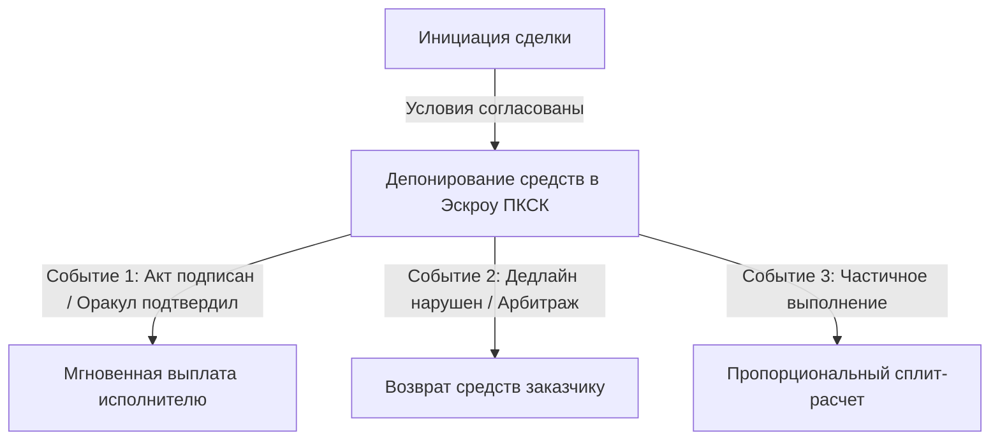

# 📑 Архитектурный Паспорт Смарт-Контракта (PASSPORT.md)

> **Стандарт:** SmartContractum PKSC Protocol v2.0  
> **Интеграционный контур:** Платформа Конструктор Смарт-Контрактов (ПКСК) Банка России

---

## 1. Идентификация и метаданные контракта
- **Contract UUID:** `sc-pkg-00000000`
- **Тип соглашения:** Двусторонний/Многосторонний смарт-контракт с эскроу-логикой
- **Регуляторный статус:** Umbrella-контур SmartContractum (Лицензированный шлюз)
- **Исполняемая среда:** Сертифицированная виртуальная машина ПКСК

---

## 2. Модель «Дерева решений» (Decision Tree Logic)

---

## 3. Требования к безопасности и аудиту
- Формальная математическая верификация условий.
- Защита от переполнения и повторного входа (Reentrancy Guard).
- Автоматический аудит кода и соответствие стандартам Банка России.
