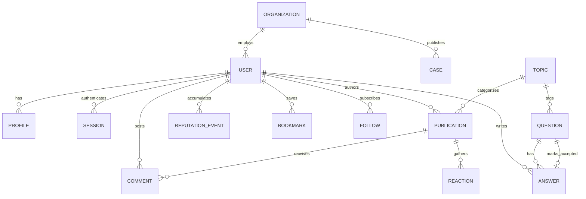

# Доменная модель сущностей платформы SmartContractum (Этап 1)

**Проект**: SmartContractum  
**Автор**: `architect_bot` / `pm_bot`

---

## 1. Схема доменных сущностей (ERD)

---

## 2. Спецификация ключевых сущностей

1. **`User` (Учетная запись)**:
   - `id`, `email`, `password_hash`, `password_salt`, `account_type` (`individual`, `ip`, `organization`), `phone`, `is_verified`, `created_at`.
2. **`Profile` (Публичный профиль)**:
   - `user_id`, `display_name`, `handle`, `avatar_url`, `headline_role`, `company_name`, `bio`, `competencies` (JSON list), `reputation_score`, `badges` (JSON list), `followers_count`, `following_count`.
3. **`Organization` (Организация)**:
   - `id`, `inn`, `ogrn`, `kpp`, `full_name`, `short_name`, `org_type` (`bank`, `dev`, `integrator`, `auditor`, `data_provider`, `legal`), `verification_status`, `ceo_name`, `address`.
4. **`Publication` / `FeedItem` (Единая абстракция публикации)**:
   - `id`, `type` (`question`, `article`, `discussion_rfc`, `case`, `post`, `data_source`), `author_id`, `topic_id`, `title`, `slug`, `lead_text`, `body_content`, `tags` (JSON list), `helpful_count`, `views_count`, `status` (`draft`, `published`, `archived`), `created_at`, `updated_at`.
5. **`Question` (Расширение для Q&A)**:
   - `publication_id`, `is_solved` (boolean), `accepted_answer_id`, `bounty_reward` (nullable).
6. **`Answer` (Ответ на вопрос)**:
   - `id`, `question_id`, `author_id`, `body_content`, `is_accepted` (boolean), `helpful_count`, `created_at`.
7. **`Comment` (Комментарий к материалу/ответу)**:
   - `id`, `parent_publication_id`, `author_id`, `text`, `created_at`.
8. **`Bookmark` (Приватная закладка)**:
   - `id`, `user_id`, `publication_id`, `created_at`.
9. **`Follow` (Подписка на автора/организацию/тему)**:
   - `id`, `follower_id`, `target_type` (`user`, `organization`, `topic`), `target_id`, `created_at`.
