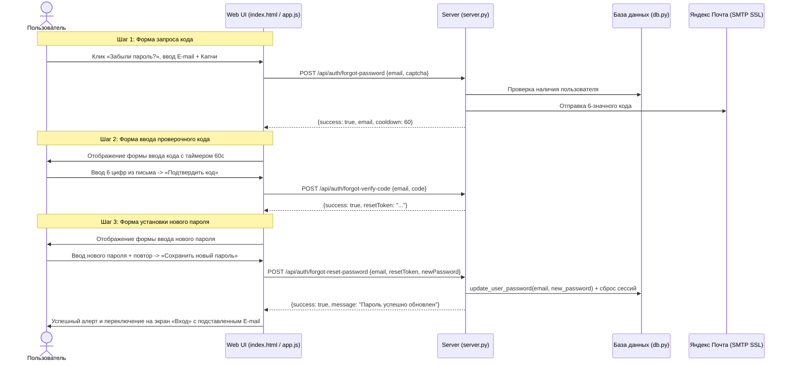

# Product Specification: TASK-03 — Трехэтапный механизм сброса и восстановления пароля

## 1. Цель
Реализовать безопасный, плавный и интуитивно понятный сквозной процесс восстановления доступа к учетной записи по клику «Забыли пароль?» с поэтапным подтверждением через проверочный E-mail код (SMTP) и установкой нового криптостойкого пароля.

---

## 2. Проблема пользователя
Пользователь, забывший пароль от Личного кабинета, не имеет возможности оперативно и безопасно восстановить доступ. Необходим прозрачный пошаговый процесс:
1. Запрос проверочного кода на привязанный E-mail.
2. Ввод 6-значного проверочного кода из письма в удобном окне.
3. Ввод и подтверждение нового пароля с контролем его надежности.
4. Автоматическое перенаправление на форму входа.

---

## 3. Пользовательские истории (User Stories)
- **US-01 (Запрос сброса)**: *Как зарегистрированный пользователь, забывший пароль*, я хочу указать свой E-mail и защитную капчу, чтобы система выслала мне одноразовый проверочный код.
- **US-02 (Ввод проверочного кода)**: *Как пользователь, получивший письмо*, я хочу увидеть отдельное окно для ввода 6-значного кода с таймером обратного отсчета (60 сек) для повторной отправки, если письмо не дошло сразу.
- **US-03 (Установка нового пароля)**: *Как подтвердивший владение E-mail пользователь*, я хочу получить окно ввода нового пароля с индикатором его сложности (Password Strength Meter) и валидацией совпадения подтверждения.
- **US-04 (Авторизация с новым паролем)**: *Как пользователь, успешно обновивший пароль*, я хочу получить уведомление об успехе и возможность сразу войти в Личный кабинет.
- **US-05 (Навигация назад)**: *Как пользователь, случайно нажавший «Забыли пароль?»*, я хочу иметь возможность в один клик вернуться к форме входа на любом этапе.

---

## 4. Пошаговые сценарии (User Flows)

---

## 5. Бизнес-правила (Business Rules)
- **BR-01 (Защита от перебора / Капча)**: Запрос кода сброса невозможен без прохождения Canvas-капчи.
- **BR-02 (Таймаут и срок жизни кода)**: 6-значный проверочный код действителен ровно 10 минут. Повторный запрос разрешен через 60 секунд.
- **BR-03 (Одноразовый токен сброса)**: После проверки кода выдается криптографический `reset_token` (256 бит) со сроком жизни 15 минут, используемый только один раз для смены пароля.
- **BR-04 (Парольная политика)**: Новый пароль должен содержать минимум 8 символов, заглавную букву и цифру.
- **BR-05 (Инвалидация старых сессий)**: При успешной смене пароля все активные сессии пользователя в таблице `sessions` удаляются для предотвращения несанкционированного доступа с ранее авторизованных устройств.

---

## 6. Критерии приемки (Acceptance Criteria)
- [ ] Клик на «Забыли пароль?» на форме входа открывает шаг 1 формы восстановления без перезагрузки страницы.
- [ ] При корректном E-mail и капче отправляется реальное письмо через SMTP и интерфейс плавно переключается на шаг 2 (ввод кода).
- [ ] На шаге 2 работает обратный отсчет 60 секунд и кнопка «Отправить код повторно».
- [ ] При вводе неверного кода выводится предупреждение, поле ввода подсвечивается ошибкой.
- [ ] При верном коде открывается шаг 3 (установка нового пароля).
- [ ] На шаге 3 работает Password Strength Meter и проверка совпадения паролей в реальном времени.
- [ ] После успешного сохранения пароля выводится подтверждение, и пользователь возвращается на форму «Вход» с предзаполненным E-mail.
- [ ] Авторизация со старым паролем блокируется, вход с новым паролем завершается успешно.
