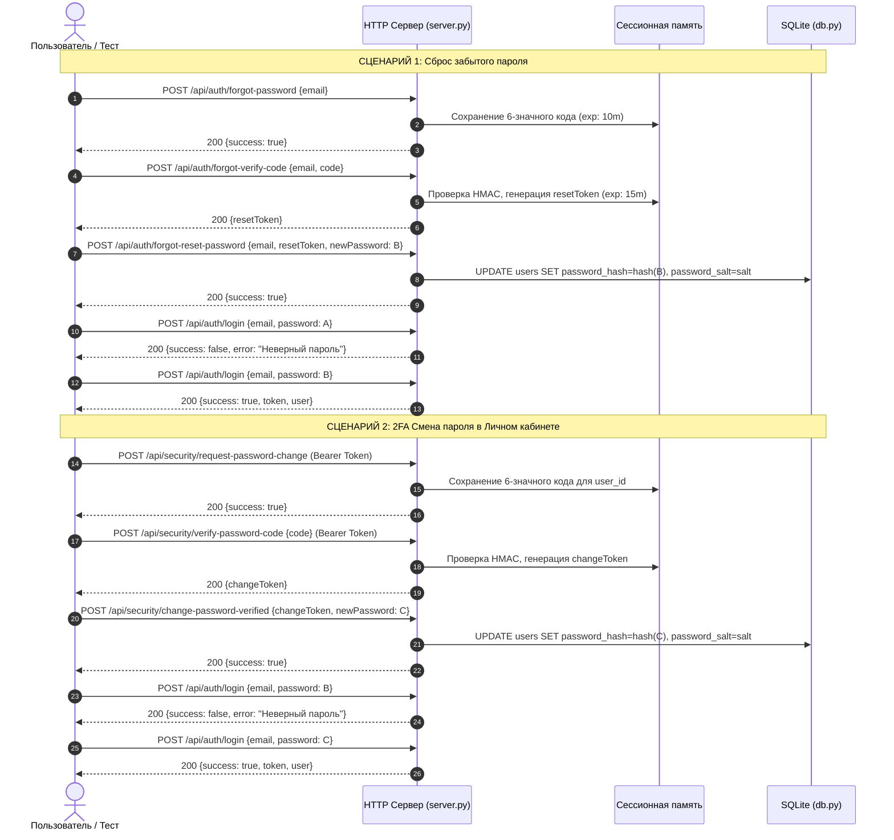

# TECH_SPEC.md — Техническая спецификация аудита и E2E тестов (TASK-10)

## 1. Схема сквозной верификации

```mermaid
sequenceDiagram
    autonumber
    actor User as Пользователь / Тест
    participant Server as HTTP Сервер (server.py)
    participant Memory as Сессионная память
    participant DB as SQLite (db.py)

    Note over User,DB: СЦЕНАРИЙ 1: Сброс забытого пароля
    User->>Server: POST /api/auth/forgot-password {email}
    Server->>Memory: Сохранение 6-значного кода (exp: 10m)
    Server-->>User: 200 {success: true}
    User->>Server: POST /api/auth/forgot-verify-code {email, code}
    Server->>Memory: Проверка HMAC, генерация resetToken (exp: 15m)
    Server-->>User: 200 {resetToken}
    User->>Server: POST /api/auth/forgot-reset-password {email, resetToken, newPassword: B}
    Server->>DB: UPDATE users SET password_hash=hash(B), password_salt=salt
    Server-->>User: 200 {success: true}
    User->>Server: POST /api/auth/login {email, password: A}
    Server-->>User: 200 {success: false, error: "Неверный пароль"}
    User->>Server: POST /api/auth/login {email, password: B}
    Server-->>User: 200 {success: true, token, user}

    Note over User,DB: СЦЕНАРИЙ 2: 2FA Смена пароля в Личном кабинете
    User->>Server: POST /api/security/request-password-change (Bearer Token)
    Server->>Memory: Сохранение 6-значного кода для user_id
    Server-->>User: 200 {success: true}
    User->>Server: POST /api/security/verify-password-code {code} (Bearer Token)
    Server->>Memory: Проверка HMAC, генерация changeToken
    Server-->>User: 200 {changeToken}
    User->>Server: POST /api/security/change-password-verified {changeToken, newPassword: C}
    Server->>DB: UPDATE users SET password_hash=hash(C), password_salt=salt
    Server-->>User: 200 {success: true}
    User->>Server: POST /api/auth/login {email, password: B}
    Server-->>User: 200 {success: false, error: "Неверный пароль"}
    User->>Server: POST /api/auth/login {email, password: C}
    Server-->>User: 200 {success: true, token, user}
```
